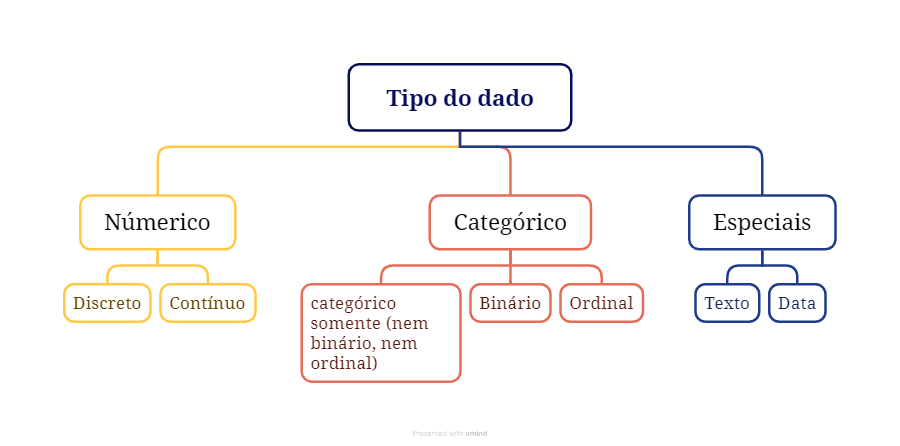

```{r echo=FALSE}
# install.packages('reticulate')
library('reticulate')
# install.packages('tidyverse')
library('tidyverse')
```

# Prefácil

A Harvard Business Review, revista conceituada em administração e negócios, em uma matéria de opinião, afirmou no título que este é um dos empregos mais sexy deste século 21 e exemplificou o conceito do que é um ser um cientista de dados [@hbr2012]. Porém, acredito que outras pessoas podem ter visões diferentes do que é um emprego sexy, como por exemplo Joel Grus (2016) [@grus2016], que acredita que a matéria da Harvard Business foi escrito por alguém que nunca visitou um quartel do corpo de bombeiros. Particularmente, a escolha do que é ser sexy foge do escopo desse **livro** e me parece uma questão pessoal. Porém, o consenso é que o campo está em alta e em evidência.

A quantidade de dados disponível vem crescendo exponencialmente e analisá-los tem sido útil para diversas organizações e para a sociedade como um todo. Muitas pesquisas estão sendo escritas sobre esse tema, com a descrição de experimentos e com achados importantes. Logo, a habilidade em lidar com esses dados e reportá-los é crucial para o profissional que deseja extrair informação útil e construir conhecimento. Este livro visa preencher esta lacuna e dar ao leitor uma visão prática e teórica com exemplos de programação em R e em Python.

# Introdução

Vamos começar pelos conceitos básicos e criar um vocabulário consistente para permitir uma comunicação mais clara nas seções futuras.

## Dado e Informação

Dado e informação nesse contexto são coisas diferentes. Nas análises preditivas, que será explicado mais adiante, as informações são extradas a partir dos dados. Neste contexto os dados são os fatos brutos. Por exemplo, o nome de um estudante e o número do CPF são exemplos de dados.

Informação é quando utilizamos os dados aplicados em um contexto. Por exemplo, os dados do nome e do CPF de um estudante podem fazer parte de uma lista de alunos matriculados em um curso técnico de informática de um Instituto Federal.

## Classificação do Dado

Vamos classificar o dado em algumas categorias que nos permitirão uma comunicação, mais consistente, com menos redundância. Essas classificações facilitarão a nossa comunicação em assuntos mais avaçados.

### Quanto ao tipo do dado

É necessário classificar o dado quanto ao seu tipo pois os algoritmos de aprendizagem de máquina, ou os modelos estatísticos de inferência (termos que serão explicados mais a frente), irão funcionar com determinados tipos de determinadas formas. Logo, com o conhecimento da classificação do tipo do dado poderemos realizar, ou não, as conversões ou tratamentos adicionais que forem necessários.

O tipo do dado pode ser: **numérico** (também chamado de quantitativo), **categórico** (também chamado de qualitativo). Ou se enquadram na categoria **Especial** (entre eles dados do tipo **texto** e dados do tipo **data**) Vide figura abaixo.

{width="496"}

Um dado do tipo **numérico** é expresso geralmente como um número real. Porém, existem casos em que números inteiros também expressam dados do tipo **categóricos,** portanto não é só ter número que já podemos classificá-lo como numérico. Já o dado do tipo **categórico** está relacionado a um valor dentro de um lista (geralmente finita - porém nem sempre) de valores. A formação acadêmica de uma determinada pessoa (Ensino Fundamental, Médio ou Superior), por exemplo, é um dado do tipo **categórico**. Já o salário, é um dado to tipo **númerico**.

Dados do tipo **numérico** e **categórico** são comumente utilizados em estatística inferencial e aprendizagem de máquina e serão detalhados nas seções seguintes.

#### Dado do tipo numérico (ou quantitativo)

O tipo do dado **numérico**, também chamado de quantitativo, ainda pode ser sub classificado como **numério** **contínuo** ou **númerico** **discreto**.

Um dado **numérico** **contínuo** é quando o dado pode ser qualquer número em um intervalo de números reais - lembrando que o conjunto de número reais engloba os números inteiros -. Geralmente é o resultado de uma medida, por exemplo, a altura de um estudante (por exemplo 1,80 metros) é um dado do tipo **numérico** **contínuo**.

O dado **numérico discreto** geralmente é resultado de uma contagem - um número inteiro -, por exemplo, a idade de um estudante (42 anos) é uma contagem, é um dado **numérico discreto**.

#### Dado do tipo categórico (ou qualitativo)

Um dado é do tipo **categórico** quando representa um valor dentro de um conjunto ou de uma categoria.

O dado **categórico** pode ser **categótico binário** ou **categórito ordinal**, ou nenhuma das duas subcategorias, ou seja **categórico somente**.

Um exemplo de **dado categórico somente**, é a cor preferida por uma pessoa (por exemplo eu prefiro a cor azul), ou o estado civil de uma pessoa (no meu caso casado).

O dado do tipo **categórico binário** é quando ele somente pode assumir dois valores no universo de valores possíveis. Por exemplo, 0 ou 1, existente ou ausente, true ou false, sim e não, aprovado ou reprovado.

O dado do tipo **categórico ordinal** é quando o valor é um elemento de um conjunto que pode ser ordenado, por exemplo, imagine a classificação dos seres humanos entre criança, jovem e adulto. Nesse exemplo, existe uma ordem temporal, o jovem já foi uma criança, o adulto já foi um jovem.

#### Exemplos de tipo do dado

| Variável                                 | Tipo do dado                                  |
|----------------------------------|--------------------------------------|
| Idade (14, 17, 23)                       | numérico discreto                             |
| Doença (Ausente, Presente)               | categório binário                             |
| Story Points (1, 3, 5, 7 ... )           | categorico ordinal                            |
| Ano (2021, 2022, ...)                    | numérico discreto                             |
| Altura (1,79 - 2,05 - ...)               | numérico contínuo                             |
| Estado Civil (Casado, Solteiro)          | categórico binário                            |
| Cores preferidas (Azul, verde, vermelho) | categórico somente (nem binário, nem ordinal) |

#### Tabelas

Os dados geralmente são organizados em formato de tabelas. Onde as linhas representam as obseravações (ou instâncias) e as colunas representam as variáveis.

Vamos utilizar o exemplo de uma empresa que desenvolve software e registra os dados relacionados a seus projetos. Essa empresa mantem o registro de determinada funcionalidade e do tamanho dessa funcionalidade. Cada linha da tabela representa uma funcionalidade (chamada de User Story em projetos que utilizam SCRUM). Cada coluna representa uma informação dessa User Story. As informações que a empresa mantém registro são as variáveis, as colunas da tabela. Uma dessas variáveis é a descriçao, outra é uma estimativa que o desenvolvedor atribui do tamanho funional, chamado Story Point. Essas informações estão dispostas em um arquivo no formato CSV. O código abaixo, carrega esse arquivo e exibe parte de seu conteúdo. Iremos então classificar cada uma das colunas de acordo com o tipo do dado.

Código R

```{r echo=FALSE}
df <- read_csv('data/neodataset/7764.csv')
head(df)
```

Código Python

```{python}
import pandas as pd
#pd.set_option('max_columns', None)
df = pd.read_csv('data/neodataset/7764.csv')
df.head()
```

A tabela abaixo não é um exemplo dos dados é a classificação, note que o que era antes coluna virou linha.

| Nome da Coluna | Tipo do dado       | Observação                                                                                                  |
|-----------------|-----------------|---------------------------------------|
| Issuekey       | categorico somente | Apesar de ser um número, não são realizadas operações no número, ele é um identificador único da User Story |
| storypoints    | numérico discreto  | É um número geralmente de 1 á 100                                                                           |
| created        | data               | Data em que a User Story Foi criada                                                                         |
| title          | texto              | Título da User Story                                                                                        |
| description    | texto              | Desrição da User Story                                                                                      |

A tabela acima apresenta a caracterização dos dados do conjunto de dados neodataset (esse conjunto de dados pode ser baixado em ...). Nessa tabela foram tipificados os dados. É interessante apresentar essa tipificação em estudos cientificos e trabalhos de conclusão de curso, quando estamos lidando com conjuntos de dados. Cabe ressaltar que essa tipificação independe da linguagem. Internamente cada linguagem de programação tem seus tipos especificos e que podem ter pequenas diferenças entre as linguagens.

#### Tipo do dado / atributo (Preditor, Alvo)

Nos modelos de aprendizagem de máquina (quando lidamos com algoritmos classificados como supervisionados) e de inferência estatistica o dado também pode ser classificado entre atributo preditor ou atributo alvo. Atributo preditor, são os atributos que serão utilizados para realizar a previsão, geralmente um ou mais atributos. Atributo alvo é o atributo que queremos 'advinhar (ou dar o melhor chute técnico)' com os modelos preditivos. Atributo preditor muitas vezes é chamado de vairável independente, e atributo alvo de variável dependente.

| Col1       | Tipo do dado (numerico ou categorico) | Tipo do atributo (preditor ou alvo) |
|------------------|----------------------------|--------------------------|
| IssueKey   | categorigo somente                    | \-                                  |
| StoryPoint | numerico discreto                     | alvo                                |
| Created    | data                                  | \-                                  |
| Title      | texto                                 | preditor                            |
| Desription | texto                                 | preditor                            |

Ou seja, no modelo proposto, o título e a descrição serão os atributos preditores do atributo alvo, espera-se que os dados do título e da descrição contenham as informações necessárias para a estimativa em Story Points.

## Estimativas de localização

Muitas vezes é conveniente representar um conjunto de números de uma forma mais simples. Nem sempre temos a possibilidade de lidar com vários números, por limitação ou por falta de praticidade. Por exemplo, imagine uma sala de aula com 5 estudantes, vamos montar uma lista da idade de todos os estudantes nessa sala no R e no Python, duas linguagens de programação comumente utilizadas em análise de dados.

Código R

```{r}
idades <-c(14,15,16,14,17)
idades
```

Código Python

```{python}
idades = [14, 15, 16, 14, 17]
print(idades)
```

Podemos representar essa lista com um número mais simples, que pode resumir ou representar aquela lista original. Para isso, utilizamos as **estimativas de localização [@bruce2020practical]**. As mais comuns são **média** e **mediana**.

### Média

A média é calculada dividindo a soma de todos os números da lista pela quantidade de itens. Sua fórmula matemática é apresentada em FIGURA XXX. Onde i é a quantidade de itens da lista e $x_i$ é o enésimo item da lista. O termo média também pode ser representado pelo símbolo $X$

No nosso exemplo se fossemos calcular manualmente a média da lista **idade**, o cálculo seria:

Código R

```{r}
( 14 + 15 + 16 + 14 + 17 ) / 5
```

Código Python

```{python}
print(( 14 + 15 + 16 + 14 + 17 ) / 5)
```

Porém, podemos utilizar algumas funções que já disponibilizam esse recurso de calular a média. O código para criar uma lista e verificar a média dessa lista, utilizando as funções, no R e no Python, seria o seguinte:

Código R

```{r}
idades <- c(14, 15, 16, 14, 17)
mean(idades)
```

Código Python

```{python}
from statistics import mean 
idades = [14, 15, 16, 14, 17]
print(mean(idades))
```

A função **mean,** no R, recebe como parâmetro uma lista de itens e retorna a média dessa lista, no python utilizei a função mesmo nome, porém disponível na biblioteca statistics do python.
